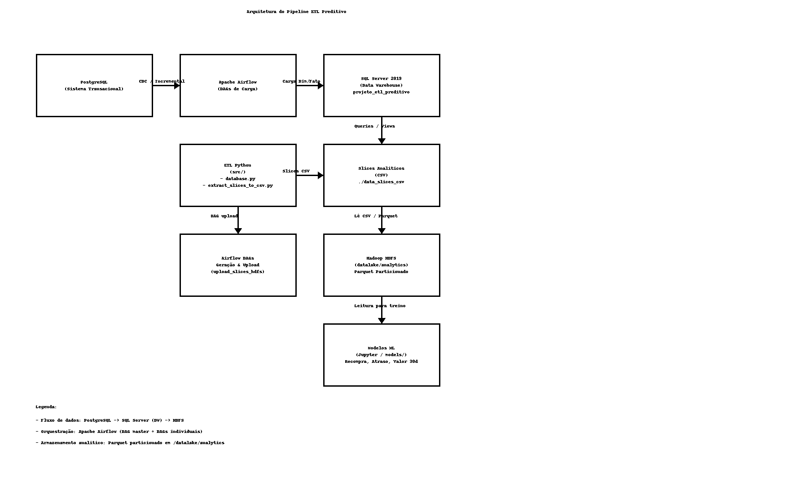

# 🧠 ETL Preditiva — Data Engineering & Analytics Pipeline

[]()
[]()
[]()
[]()
[]()

Este projeto implementa um **pipeline completo de engenharia de dados**, incluindo:

- Orquestração com Airflow  
- Data Lake em Hadoop HDFS  
- Data Warehouse em SQL Server  
- Extração de dados de PostgreSQL  
- ETL em Python  
- Geração de **slices analíticos** para Machine Learning  
- Armazenamento particionado em Parquet  

Tudo containerizado via **Docker Compose**.

---

## 📐 Arquitetura Geral



---

## 🚀 Funcionalidades Principais

### 🔹 ETL Completo (PostgreSQL → SQL Server DW)
- Extração incremental
- Transformações e limpeza
- Modelagem dimensional
- Tabelas Dimensão:
  - Cliente, Vendedor, Produto, Categoria, Fornecedor
  - Forma Pagamento, Situação Título
  - Nota Fiscal, Parcela
- Tabelas Fato:
  - FatoVendas
  - FatoPagamentos
  - FatoRecebimentos

### 🔹 Geração de Slices Analíticos
Criados automaticamente em CSV:

- **Recompra em 90 dias** (classificação)
- **Atraso >30 dias** (classificação)
- **Valor em 30 dias** (regressão)

### Slices Analíticos
Gerados automaticamente em CSV e enviados ao HDFS como Parquet particionado.

### 🔹 Data Lake em Hadoop HDFS
Cada slice é convertido em **Parquet particionado**, ex:
Paths:

```
/datalake/analytics/recompra/ano=2025/mes=12/dados.parquet
/datalake/analytics/atrasos/ano=2025/mes=12/dados.parquet
```

### 🔹 Orquestração com Airflow
- DAGs individuais para cada dimensão/fato
- DAGs de geração e upload dos slices
- **DAG Master** para orquestrar tudo

---

## 🛠️ Tecnologias

| Camada | Tecnologias |
|--------|-------------|
| Orquestração | Apache Airflow 2.8 |
| Data Lake | Hadoop HDFS 3.3.6 |
| DW | SQL Server 2019 |
| OLTP | PostgreSQL |
| ETL | Python (Pandas, PyArrow, SQLAlchemy, hdfs) |
| Deploy | Docker / Docker Compose |

---

## 📂 Estrutura do Projeto
etl_preditiva/
│
├── airflow/                     # DAGs e scripts de ETL
├── docs/                        # Arquitetura e Diagramas .png
├── hadoop/                      # Configuração do HDFS
├── sqlserver/                   # Scripts e init .bak
├── postgres/                    # Scripts do banco origem
├── data_slices_csv/             # Saída intermediária
├── models/                      # Modelos preditivos (futuro)
├── logs/                        # Logs gerais
├── src/                         # Código da aplicação ETL
│   ├── database.py              # Conexões SQL Server e Postgres
│   └── ...
├── docker-compose.yml
├── Dockerfile
├── start.sh / stop.sh           # Scripts de controle
└── README.md

---
### 🤖 Machine Learning (Futuro)
```
Os slices do data lake permitem treinar modelos como:

🔹 Recompra em 90 dias

(Classificação)
Prever se o cliente fará nova compra.

🔹 Atraso no pagamento (>30 dias)

(Classificação)
Identificar comportamento de inadimplência.

🔹 Valor esperado em 30 dias

(Regressão)
Prever receita por cliente.

---
```
## ▶️ Como Executar

### 1. Criar ambiente virtual (opcional)

```
bash
python3 -m venv .venv
source .venv/bin/activate
pip install -r requirements.txt

```
### 2. Senhas arquivo .env
```
 - Modificar o nome .env.exemplo para .env
 - No .env: Configurar as credencias do Postgres_DataDT 
```
### 2. Subir todo o ambiente
```
chmod +x start.sh stop.sh
./start.sh

```
### 2. Acessos
```
- Airflow: http://localhost:8080 
- HDFS: http://localhost:9870  
- YARN: http://localhost:8088  
- SQL Server: localhost:1433  

```
### 3. Criando o bando de dados no SQL Server

```
 3.1 Rodar o script ./etl_preditiva/sqlserver/mssql_backups/projeto_etl_preditivo.sql
  - Nele tem todos os comandos DDL para criação do banco, tabelas e views.
  
 3.2 💾 Backup SQL Server: Gerar .bak do container para o host

Obs.: Rodar esse comando após o banco populado, caso queira deixar sempre uma copia atualizada no host.

docker exec etl_sqlserver /opt/mssql-tools/bin/sqlcmd    -S localhost -U sa -P "YourStrong@Passw0rd"    -Q "BACKUP DATABASE [projeto_etl_preditivo] TO DISK='/var/opt/mssql/backup/projeto_etl_preditivo.bak' WITH INIT, STATS=10"
```

Backup salvo em:

```
sqlserver/mssql_backups/
```

## 🧪 Testar HDFS

```
docker exec -it airflow_scheduler python3 - <<EOF
from hdfs import InsecureClient
client = InsecureClient("http://namenode:9870", user="root")
client.write("/teste_airflow_ok.txt", data=b"ok", overwrite=True)
print(client.list("/"))
EOF
```

## 👨‍💻 Autor
Projeto desenvolvido para fins de engenharia de dados, automação e machine learning(ainda em desenvolvimento).
